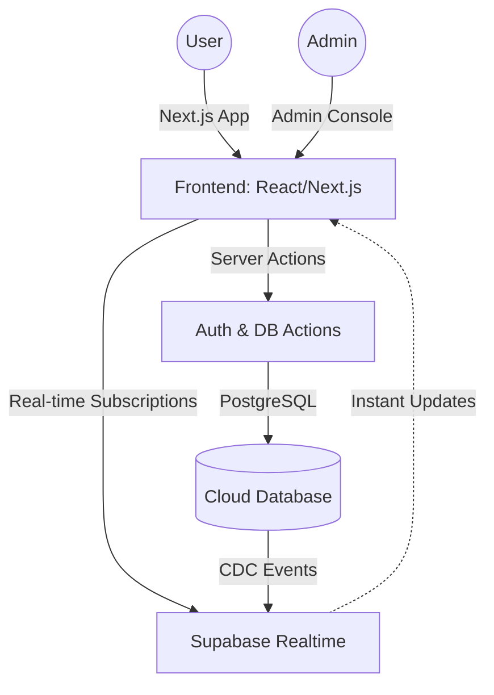

# 🩸 DIC Blood Bank: Real-Time Lifesaving Network

[](https://github.com/SadiEncoded/DIC-Blood-Bank)
[](https://dribbble.com)
[](https://github.com/SadiEncoded/DIC-Blood-Bank)

A high-performance, real-time blood donor management platform built for speed, safety, and community impact. Designed with a **FAANG-level** aesthetic and powered by a fully reactive data layer.

---

## ✨ Core Pillars

### 1. 🚀 Global Real-Time Hub

Every interaction is live. No refreshes. No delays.

- **Learn Feed**: Educational articles sync instantly across all clients.
- **Community Wall**: Official notices and announcements appear in real-time.
- **Matched Donors**: Live availability and verification status updates during the search process.

### 2. 🛡️ Admin Command Center

A centralized dashboard for mission-critical operations.

- **Live Verification Pipeline**: Review donation proofs as they arrive.
- **Dynamic Content Management**: Draft, publish, and toggle articles/events with instant global updates.
- **Impact Metrics**: Watch "Lives Saved" and "Pending Requests" counters tick up in real-time.

### 3. 🧠 Smart Match Engine

Triangulates the perfect donor for every critical need.

- **Location-Aware Scanning**: Filters donors by proximity and urgency.
- **Admin Verification Bridge**: Every donor request is held in a secure queue until manually reviewed and approved by an administrator to prevent abuse.
- **Safety-First Routing**: Multi-layered validation checks (Protocol Simulation + Admin Oversight + Social Proof).
- **Stepped Workflow**: A sleek, animated wizard guides requesters from data entry to contact.

---

## 🏗️ Technical Architecture



### Stack & Performance

- **Framework**: [Next.js](https://nextjs.org) (App Router, Server Components)
- **Database**: [Supabase](https://supabase.com) (PostgreSQL + Realtime Engine)
- **Styling**: [Tailwind CSS](https://tailwindcss.com) + [Framer Motion](https://framer.com/motion) for 60fps micro-interactions
- **State**: Reactive local state synced via Supabase Channels

---

## 📱 Design Philosophy: "Mobile-First Premium"

We've optimized every pixel for the mobile experience, where seconds count.

- **Glassmorphic UI**: Subtle blurs and semi-transparent layers for depth.
- **Tactile Feedback**: Shake animations on form errors and smooth transitions between stages.
- **High-Contrast Accessibility**: Bold typography and intentional whitespace for readability under pressure.

---

## 🛠️ Setup & Implementation

1. **Environment Config**:

   ```bash
   NEXT_PUBLIC_SUPABASE_URL=your_url
   NEXT_PUBLIC_SUPABASE_ANON_KEY=your_key
   ```

2. **Install Dependencies**:

   ```bash
   npm install
   ```

3. **Run Dev Environment**:

   ```bash
   npm run dev
   ```

---

## 📄 Key Contributors & Impact

DIC Blood Bank is a community-driven initiative dedicated to bridging the gap between donors and patients. **Every drop counts.**

### 👨‍💻 Lead Developer

**Sadi (SadiEncoded)**  
*Full Stack Developer*

Sadi is the architect behind the DIC Real-Time Network. With a focus on high-performance systems and FAANG-level aesthetics, he has transformed blood donation management into a seamless, lifesaving experience.

[**Follow Sadi on GitHub**](https://github.com/SadiEncoded)

---
